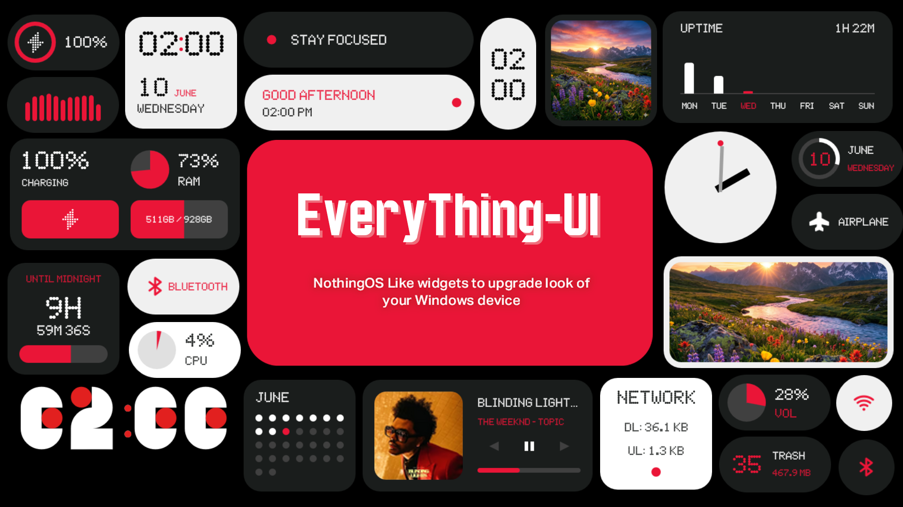
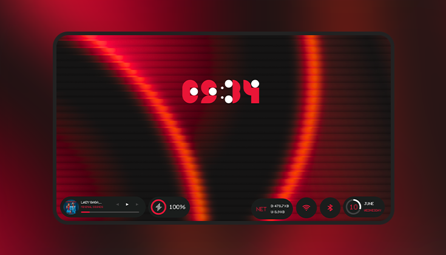
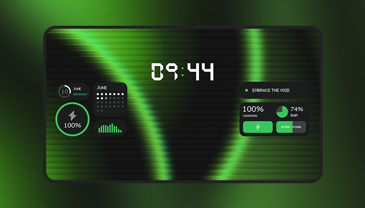
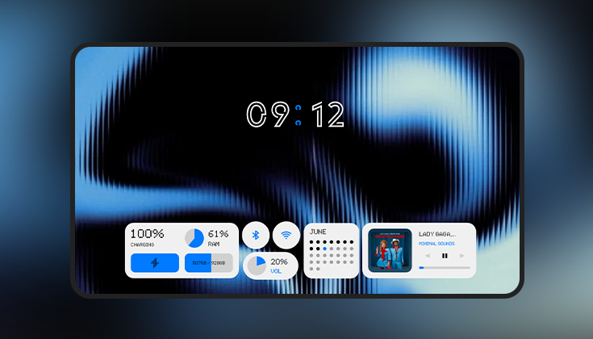
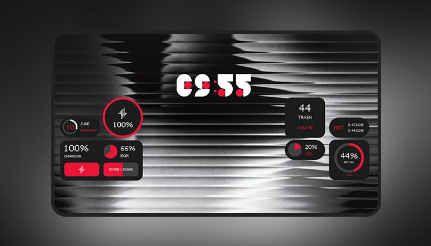
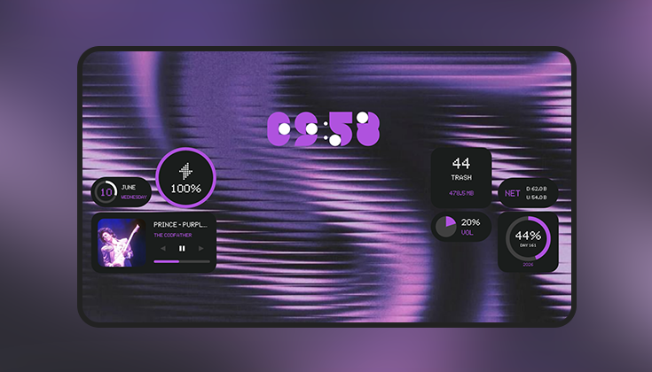
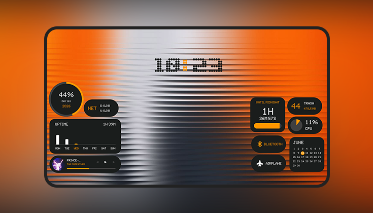

  
  <h1>EveryThing-UI</h1>
  

    A minimalist, Nothing OS inspired widget suite designed for Rainmeter. 
    Created to provide an elegant and cohesive desktop customization experience. 
    Built with a focus on modern aesthetics and seamless grid-based layouts.
  

## Features

- Clean, aesthetic, modern widget designs
- Pill-shaped and block layouts for flexible grids
- Light and Dark modes for every widget
- **Modules & Utilities**:
  - **System Status**: Battery, Disk Space, RAM usage
  - **Media & Audio**: SMTC Player (Spotify, YouTube), Visualizers
  - **Clocks & Dates**: Analog/Digital Clocks, Calendars, Greetings
  - **Hardware**: CPU usage, Network speeds, Year Progress
  - **Quick Utilities**: WiFi, Airplane, Bluetooth, Volume toggles
  - **Photos**: Customizable image frames
  - **Time Tracking**: Uptime, Countdown timers
  - **Personalization**: Rotating Mantra widget

## Installation

- Download and install Rainmeter
- Download latest release (`EveryThing-UI_1.0.rmskin`) from Releases
- Double-click `.rmskin` to install
- Open Rainmeter Manager → `EveryThing-UI` → load widgets
- **Manual Install:** Clone/download repo, move folder to `Documents\Rainmeter\Skins`, right-click Rainmeter icon in tray → "Refresh all"

## Screenshots

  
  
  
  
  
  

## Customization

- Edit `[Variables]` in `.ini` files to globally change colors, fonts, or scales
- ⚠️ **Warning:** Resizing widgets may break their layout!

## Skins

| Skins / Category | Variants | Dark / Light |
| :--- | :---: | :---: |
| **Battery** 1, 2 | 1 each | ✔️ |
| **Clock** 1, 3 | 2 each | ✔️ |
| **Clock** 2, 4 | 1 each | ✔️ |
| **Clock** Analog, Digital | 2, 3 | ✔️ |
| **Date** & **Calendar** | 1, 2 | ✔️ |
| **Photo** 1, 2, 3, 4 | 1 each | ✔️ |
| **System** (Status, CPU, Network) | 1, 2, 2 | ✔️ |
| **Utilities** (WiFi, Vol, BT, Airplane) | 2 each | ✔️ |
| **Tracking** (Uptime, Countdown, Year) | 1, 2, 2 | ✔️ |
| **Media** (Player, Visualizer) | 2, 3 | ✔️ |
| **Misc** (RecycleBin, Greeting, Mantra)| 2, 2, 1 | ✔️ |

## Future Updates

- More skins will be added in future

## Author

- Created and maintained by Prince-1652
